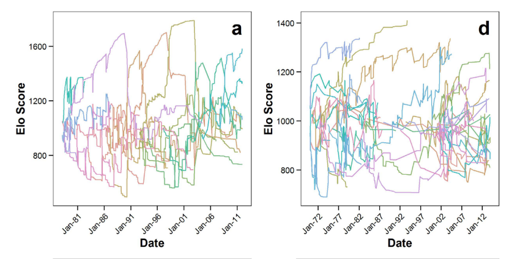

```{r setup, include=FALSE}
knitr::opts_chunk$set(
	echo = TRUE,
	warning = TRUE,
	message = TRUE,
	comment = "##",
	prompt = FALSE,
	tidy = TRUE,
	tidy.opts = list(blank = FALSE, width.cutoff = 75),
	fig.path = "img/",
	fig.align = "center"
)
library(dplyr)
library(EloRating)
```

## Introduction

Foerster et al. developed a likelihood-based Elo rating method to look at rank dynamics (changes in hierarchy membership vs. successful challenges of higher-ranking individuals), and applied this to a long-term dataset of intrasexual dominance interactions (pant-grunts and aggressions with clear winners/losers) among both female and male chimpanzees at Gombe, Tanzania. They found a substantial sex difference: while females queue for social status, males actively challenge higher-ranking males to raise their own rank over time.

They used 3 different models, for which initial Elo scores were:
1) fixed at 0 for all individuals (initial Elo score of 1000 i.e. conventional model. Most preferred for males.)
2) forced to enter at hierarchy bottom
3) fitted for all individuals using maximum-likelihood (Most preferred for females, whose relative rank relationships do not change over their lifetimes.)

Given time (and skill!) constraints, I only replicated the first model, using the {EloRating} package.

## Loading in Data

Their dryad repository consisted of 4 xls files, which I converted to csv:
Female + male agonistic interactions (female_ago, male_ago) - IDs of winners and losers, along with date of interaction
Female + male presence grids (female_presence, male_presence) - Lists each date of study period and presence/absence of each adult individual.

Load in data for female, then male, agonistic interactions and presence grids, updating data types.
```{r}
# FEMALES
f1 <- "female_ago.csv"
female_ago <- read.csv(f1, header=T, stringsAsFactors=F, sep=",")
female_ago$Winner <- as.character(female_ago$Winner)
female_ago$Loser <- as.character(female_ago$Loser)
female_ago$Date <- as.character(female_ago$Date) # change date format for this package
female_ago <- mutate(female_ago, "Date" = paste(substr(Date,7,10), substr(Date,4,5), substr(Date,1,2), sep = "-"))
head(female_ago)

f2 <- "female_presence.csv"
female_presence <- read.csv(f2, header=T, check.names=F, stringsAsFactors=F, sep=",")
female_presence$Date <- as.character(female_presence$Date)
female_presence <- mutate(female_presence, "Date" = paste(substr(Date,7,10), substr(Date,4,5), substr(Date,1,2), sep = "-"))
female_presence$Date <- as.Date(as.character(female_presence$Date)) # presence dates must be converted to date format
head(female_presence)

# MALES
f3 <- "male_ago.csv"
male_ago <- read.csv(f3, header=T, stringsAsFactors=F, sep=",")
male_ago$Winner <- as.character(male_ago$Winner)
male_ago$Loser <- as.character(male_ago$Loser)
male_ago$Date <- as.character(male_ago$Date)
male_ago <- mutate(male_ago, "Date" = paste(substr(Date,7,10), substr(Date,4,5), substr(Date,1,2), sep = "-"))
head(male_ago)

f4 <- "male_presence.csv"
male_presence <- read.csv(f4, header=T, check.names=F, stringsAsFactors=F, sep=",")
male_presence <- select(male_presence, -1) # removing mysterious first unnamed column of indexes - how did it get there in the first place??
male_presence$Date <- as.character(male_presence$Date)
male_presence <- mutate(male_presence, "Date" = paste(substr(Date,7,10), substr(Date,4,5), substr(Date,1,2), sep = "-"))
male_presence$Date <- as.Date(as.character(male_presence$Date)) # presence dates must be converted to date format
head(male_presence)
```

## Replications/Reanalysis

### I. Descriptive Statistics & Visualization: Generating Elo scores

I used the {EloRating} package to compare results generated by the maximum-likelihood method in this paper to traditional Elo Rating methods. summary() provides info about the Elo scores generated for both females and males. The plots of changes in Elo scores I generated were comparable to that of Model 1 in the paper, which makes sense given that this was the "conventional" model for which all individuals begin with the same Elo score of 1000.

```{r}
# FEMALES
female_res <- elo.seq(winner = female_ago$Winner, loser = female_ago$Loser, Date = female_ago$Date, presence = female_presence, runcheck = FALSE) # runcheck = FALSE because female_presence dates fall outside bounds of female_ago dates
summary(female_res)
eloplot(eloobject = female_res, from = "1972-01-01", to = "2012-01-31") # set date range to that of figures in paper

# MALES
male_res <- elo.seq(winner = male_ago$Winner, loser = male_ago$Loser, Date = male_ago$Date, presence = male_presence, runcheck = FALSE)
summary(male_res)
eloplot(eloobject = male_res, from = "1981-01-01", to = "2011-01-31")
```
Compare to Figure 1a (males) and 1b (females) from the paper:



### II. Inferential Statistics: Difference in relative ranks at hierarchy entry and exit

Figure 2 of the paper shows that females exit the hierarchy (emigration/death) with significantly higher rank (based on Elo scores) than they entered with, providing support for the hypothesis that females queue for rank. I tried to replicate this result but got bogged down in extracting entry and exit scores for each individual. This partly due to limitations of the {EloRating} package I used, for which scores can only be extracted by inputting exact dates. Since presence dates vary across individuals and accurate scores do not align perfectly with the presence grid data provided, I ended up with too many NAs to actually compare entry and exit scores (see tibble below). 
```{r}
entry_exit <- tibble(id = 1:44, entry = 0, exit = 0)
for (i in entry_exit$id) {
  ID = as.character(i)
  d <- select(female_presence, Date, ID)
  
  row <- 1
  present <- 0 # default to not present in hierarchy
  entryDate <- "1972-01-01"
  exitDate <- "2012-01-31"
  while (row < nrow(d)) {
    if (present == 0 && d[ID][row,] == 0) {row <- row + 1} # individual not yet in hierarchy, so we move on to next row
    if (present == 0 && d[ID][row,] == 1) {
      # save entry date
      if(as.Date(d$Date[1]) > as.Date("1972-01-01")) {
        entryDate <- as.character(d$Date[row]) # save entry dates
      }

      present <- 1 # switch status to present in hierarchy
      row <- row + 1 # update row
    }
    if (present == 1 && d[ID][row,] == 1) {row <- row + 1} # already present and still present so nothing changes
    if (present == 1 && d[ID][row,] == 0) { # was present and no longer present, so save exit date
      if(as.Date(d$Date[1]) < as.Date("2012-01-31")) {
        exitDate <- as.character(d$Date[row]) # save exit date
      }
      break
    }
  }
  entry_exit$entry[i] <- extract_elo(female_res, extractdate = entryDate, IDs = ID)
  entry_exit$exit[i] <- extract_elo(female_res, extractdate = "2012-01-31", IDs = ID)
}
entry_exit
```
BUT if I'd had more time to fiddle with the code and get it to work, I would have then conducted a Mann-Whitney U test to confirm whether exit scores were significantly higher than entry scores, and made some lovely boxplots like the one in the paper:


## Summary/Discussion

While Foerster et al.'s documentation was excellent for their extentions of the Elo ranking method, documentation of other analyses were lacking. I was hoping to replicate results on queue jumping by females of different age categories, but their publicly available data included only numbered individual ID's with no other metadata.
My inability to replicate their results on differences between entry and exit scores for females was largely due to limitations of the alternative package {EloRating} I used. Doing things completely from scratch, as Foerster et al. did, would have circumvented this issue.

## References
{EloRating} package tutorial: https://cran.r-project.org/web/packages/EloRating/vignettes/EloRating_tutorial.pdf